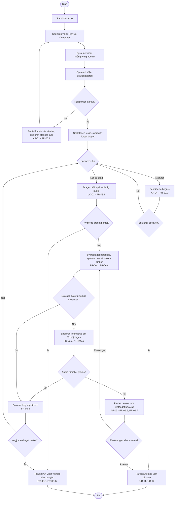

# Aktivitetsdiagram – UC-05 Spela mot datorn

Hela vägen från startsidan till resultatvyn, med de fyra alternativa flödena som grenar.
Realiserar FR-06.1 – FR-06.9 och FR-08.8.

Tidsgränsen på datorns drag är med som ett eget beslut, inte som en fotnot: FR-06.9 säger att
systemet ska försöka **en gång till** innan felet hanteras, och det syns bara i ett flöde. Det är
samma uppdelning som i sekvensdiagrammet för UC-02, där NFR-02.3 mäts på datorns svar och NFR-02.2
på klientens återkoppling — två olika mätningar trots att båda handlar om tid.

---

**Relaterade UC:** UC-05, UC-01, UC-02, UC-08, UC-11 · **Krav:** FR-06.1 – FR-06.9, FR-08.8, NFR-02.3, NFR-04.2, NFR-04.6, NFR-09.3 · **Testas av:** AC-05-01 – AC-05-07
