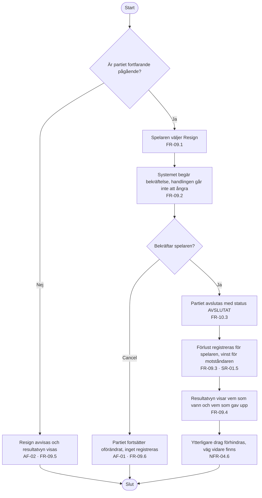

# Aktivitetsdiagram – UC-11 Ge upp

Ett kort flöde, men det innehåller två saker som är lätta att rita bort: att partiet kan vara
**redan avslutat** när knappen trycks, och att bekräftelsen går att ångra utan att något
registreras. FR-09.6 gör den andra till ett eget flöde — "Cancel" är inte samma sak som "inget
hände".

---

**Relaterade UC:** UC-11 · **Krav:** FR-09.1 – FR-09.6, FR-10.3, SR-01.5, NFR-04.1, NFR-04.6 · **Testas av:** AC-11-01 – AC-11-03
