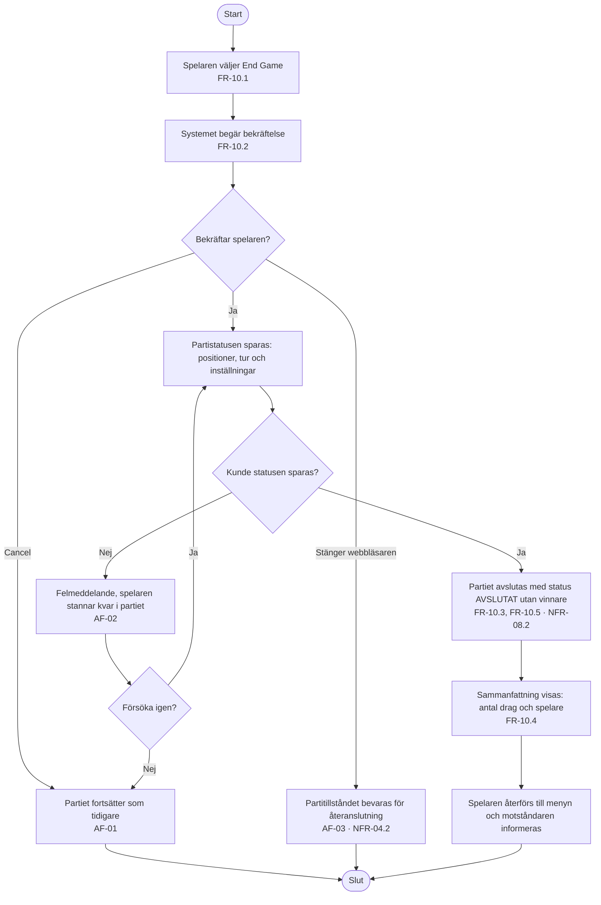

# Aktivitetsdiagram – UC-12 Avsluta ett parti

Skillnaden mot UC-11 är värd att se i ett diagram: här utses **ingen** vinnare (FR-10.5), och
statusen sparas innan partiet stängs (UC-12 steg 4). Att webbläsaren stängs är ett eget
alternativflöde — partiet ska gå att återuppta, vilket är samma krav som gör NFR-04.2 mätbart.

---

**Relaterade UC:** UC-12, UC-11, UC-26, UC-27 · **Krav:** FR-10.1 – FR-10.5, NFR-04.2, NFR-04.6, NFR-08.2 · **Testas av:** AC-12-01 – AC-12-04
