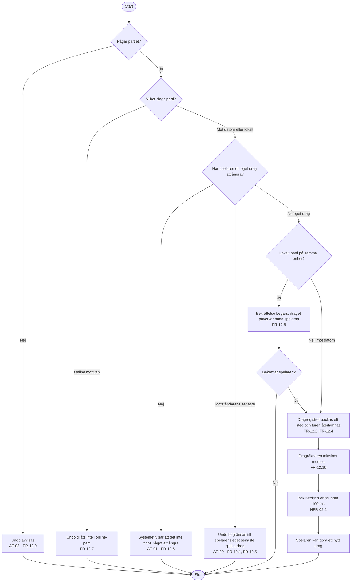

# Aktivitetsdiagram – UC-19 Ångra ett drag

Flödet ser enkelt ut, men den avgörande förgreningen är **vilket slags parti** det gäller. Den
lösta motsägelsen i FR-12 sitter här: ångring är tillåten mot datorn och i lokalt parti på samma
enhet, men **inte** i ett online-parti mot en vän (FR-12.3 mot FR-12.7). I ett hot-seat-parti sitter
båda spelarna vid samma skärm och kan se bekräftelsen — i ett online-parti kan motståndaren inte se
vad som händer med brädet, och då är en ångring något helt annat.

Notera också att det som återställs är ett **dragregister**, inte en sten: modellen i
`05-begreppsmodell.md` säger att en placerad sten inte kan tas bort. Det är FR-12.2 som gör
operationen till en registerfråga.

---

**Relaterade UC:** UC-19, UC-02, UC-18 · **Krav:** FR-12.1 – FR-12.10, NFR-02.2 · **Testas av:** AC-19-01 – AC-19-07 (AC-19-07 väntar på gruppbeslut)
