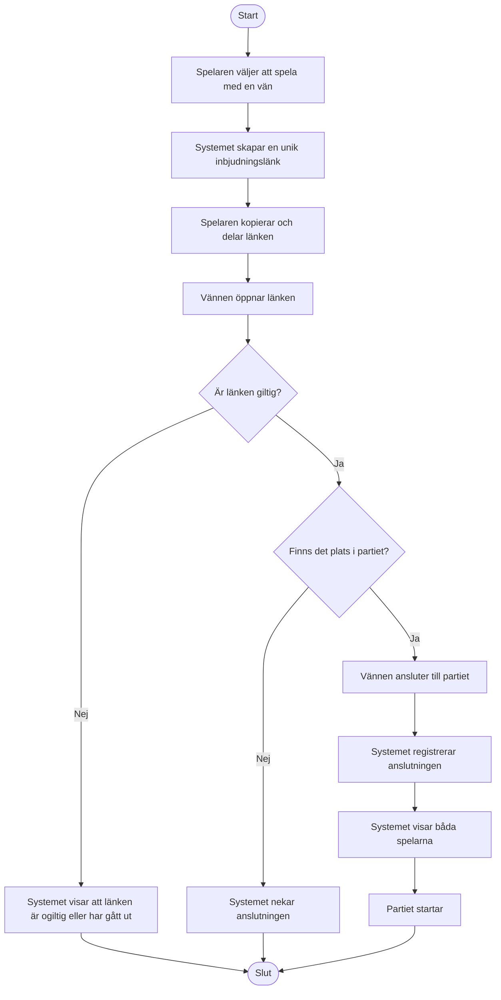

# Aktivitetsdiagram – Bjuda in en vän

```mermaid
flowchart TD
    A([Start]) --> B[Spelaren väljer att spela med en vän]
    B --> C[Systemet skapar en unik inbjudningslänk]
    C --> D[Spelaren kopierar och delar länken]
    D --> E[Vännen öppnar länken]

    E --> F{Är länken giltig?}

    F -- Nej --> G[Systemet visar att länken är ogiltig eller har gått ut]
    G --> Z([Slut])

    F -- Ja --> H{Finns det plats i partiet?}

    H -- Nej --> I[Systemet nekar anslutningen]
    I --> Z

    H -- Ja --> J[Vännen ansluter till partiet]
    J --> K[Systemet registrerar anslutningen]
    K --> L[Systemet visar båda spelarna]
    L --> M[Partiet startar]

    M --> Z
```
