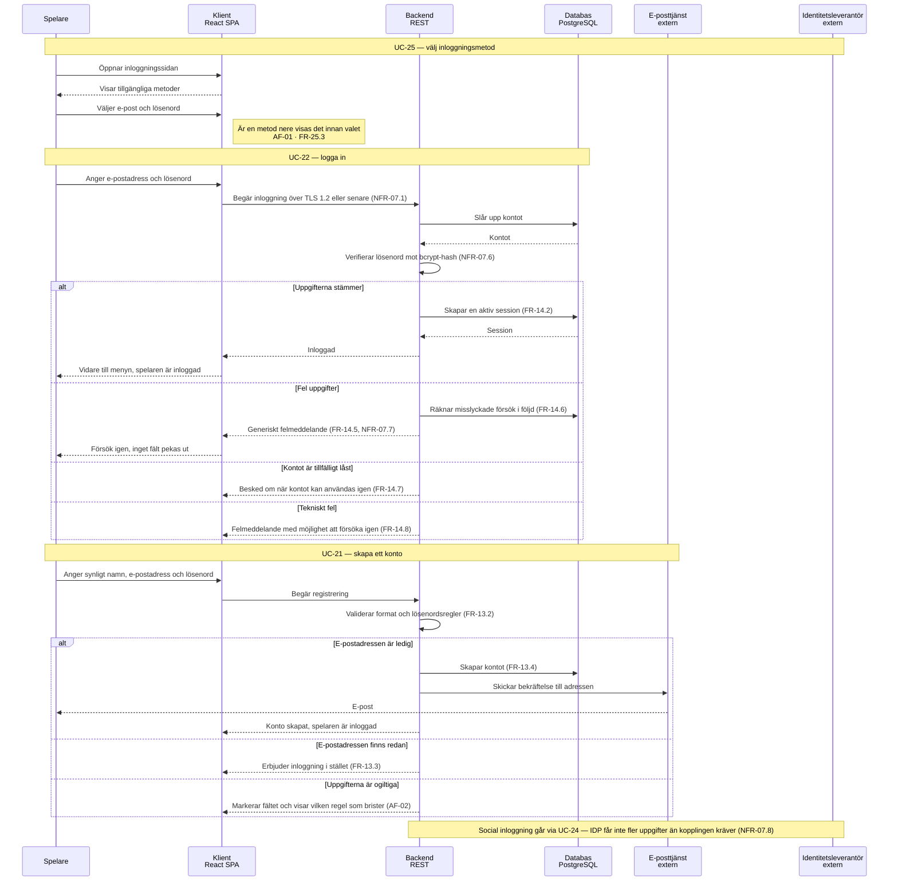

# Sekvensdiagram – UC-21, UC-22 och UC-25: konto, inloggning och inloggningsmetod

Det här är det enda flödet i systemet med **externa aktörer på andra sidan systemgränsen**:
e-posttjänsten (EP) och identitetsleverantören (IDP). Det gör diagrammet användbart för mer än
ordningen mellan anrop — det visar var personuppgifter lämnar systemet, vilket är precis de
punkter NFR-07.4 och NFR-07.8 sätter gränser för.

Valet av metod (UC-25) står först och är medvetet kort: den leder vidare till UC-22 eller UC-24 och
äger själv ingen inloggningslogik. Felmeddelandet i UC-22 är generiskt av två skäl samtidigt —
FR-14.5 och NFR-07.7 säger samma sak, och det är därför raden är kopplad till båda.

---

**Relaterade UC:** UC-21, UC-22, UC-24, UC-25, UC-30 · **Krav:** FR-13.1 – FR-13.5, FR-14.1 – FR-14.8, FR-25.1 – FR-25.5, NFR-07.1, NFR-07.4, NFR-07.6 – NFR-07.8 · **Testas av:** AC-21-01 – AC-21-07, AC-22-01 – AC-22-06, AC-25-01 – AC-25-05
