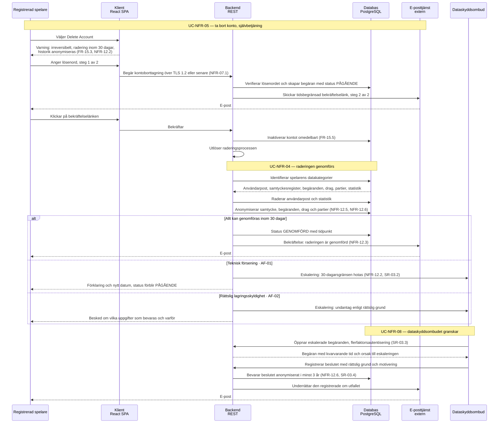

# Sekvensdiagram – GDPR: radering av personuppgifter (UC-NFR-05 → UC-NFR-04 → UC-NFR-08)

Hela kedjan i ett diagram: spelaren tar bort sitt konto (UC-NFR-05), raderingen genomförs
(UC-NFR-04) och de fall som inte kan hanteras automatiskt hamnar hos dataskyddsombudet
(UC-NFR-08). Det är det enda flödet i systemet som **inte slutar när användaren är klar** — det
fortsätter i upp till 30 dagar och kan eskalera efteråt.

Två saker syns bara här:

- **Uppdelningen radera/anonymisera.** Användarposten och statistiken raderas, men samtyckesregistret,
  begäranden, drag och partier anonymiseras och bevaras (NFR-12.5, NFR-12.6, SR-03.4). Det är
  skillnaden mellan att uppfylla artikel 17 och att samtidigt kunna visa *att* den uppfyllts.
- **Eskaleringen har en mottagare.** UC-NFR-04 skickar två eskaleringar till dataskyddsombudet
  (AF-01 och AF-02) och UC-NFR-08 är vad som händer på andra sidan. Utan det paret står DPO som
  aktör utan att äga något flöde.

Samma negativa påstående som i NFR-12.4 — att raderade uppgifter inte ska kunna återskapas — går
inte att bevisa i ett diagram eller i ett test. Den verifieras mot fem namngivna sökvägar
(AC-NFR-04-05), och det är en medveten avgränsning.

---

**Relaterade UC:** UC-NFR-02, UC-NFR-04, UC-NFR-05, UC-NFR-08, UC-23 · **Krav:** FR-15.1 – FR-15.5, FR-30.1 – FR-30.13, FR-32.1 – FR-32.8, NFR-12.1 – NFR-12.7, NFR-07.1, NFR-07.5, SR-03.1 – SR-03.4 · **Testas av:** AC-NFR-04-01 – AC-NFR-04-09, AC-NFR-08-01 – AC-NFR-08-05
