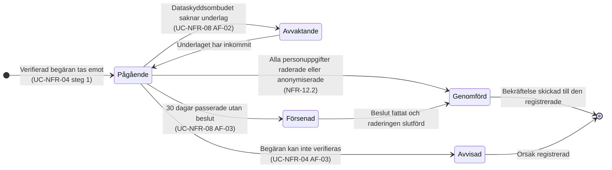

# Tillståndsdiagram – en GDPR-begäran

En raderingsbegäran är inte en händelse, den är ett ärende med ett eget liv. Det syns inte i
use case-filerna, där flödet beskrivs uppifrån och ner, men det är avgörande för efterlevnaden:
30-dagarsgränsen löper **medan** ärendet väntar, och ett ärende som väntar för länge är i sig en
avvikelse som ska dokumenteras.

`Försenad` är därför ett eget tillstånd och inte samma sak som `Avvaktande`. Den första betyder att
gränsen passerats utan beslut (UC-NFR-08 AF-03), den andra att beslutet väntar på underlag och
fortfarande kan fattas i tid.

---

**Relaterade UC:** UC-NFR-04, UC-NFR-05, UC-NFR-08 · **Krav:** FR-30.1 – FR-30.13, NFR-12.2, NFR-12.6, SR-03.2, SR-03.4 · **Testas av:** AC-NFR-04-07 – AC-NFR-04-09, AC-NFR-08-03
