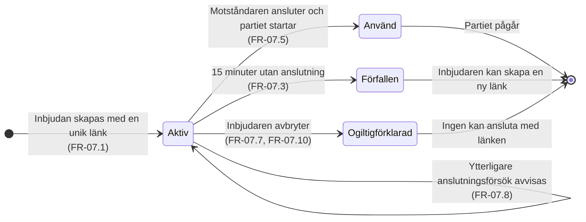

# Tillståndsdiagram – inbjudan

En inbjudan har fler tillstånd än man först tror, och de är inte samma sak som "länken fungerar"
eller inte. Den kan vara **aktiv**, ha **förfallit** efter 15 minuter (FR-07.3), vara **använd**
(partiet har startat) eller **ogiltigförklarad** av inbjudaren (FR-07.7, FR-07.10). Skillnaden
mellan de två sista spelar roll: en använd inbjudan behöver inte städas, en ogiltigförklarad får
ingen ansluta med.

Självövergången är samma sorts detalj som i turordningsdiagrammet: fler än två anslutningsförsök
avvisas (FR-07.8, SR-01.8) men **tillståndet ändras inte**. Utan den ser diagrammet ut som att ett
avvisat försök påverkar inbjudan.

---

**Relaterade UC:** UC-03, UC-07, UC-10 · **Krav:** FR-07.1 – FR-07.10, SR-01.8, NFR-02.5, NFR-02.6, NFR-04.3, NFR-07.2 · **Testas av:** AC-03-01 – AC-03-06
