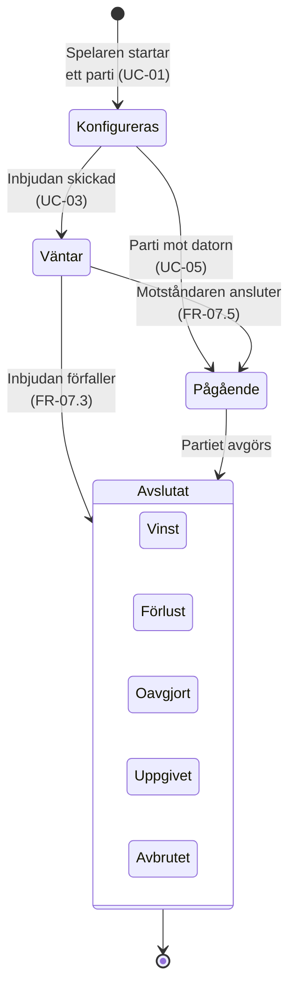

# Tillståndsdiagram – partiets livscykel

Partiet har fyra tillstånd. Turordningen är medvetet inte med här — den är en egen
angelägenhet och har ett eget diagram.

`Avslutat` är ett sammansatt tillstånd med fem utfall. De två sista, uppgivet och avbrutet, är
partiavslut **utan** vinnare (UC-11, UC-12) och glöms lätt bort när man bara tänker på
vinst/förlust/oavgjort.

---

**Relaterade UC:** UC-01, UC-03, UC-05, UC-11, UC-12, UC-14 – UC-16 · **Krav:** FR-03.3, FR-07.3, FR-07.5, FR-08.9, FR-08.11, FR-10.3
