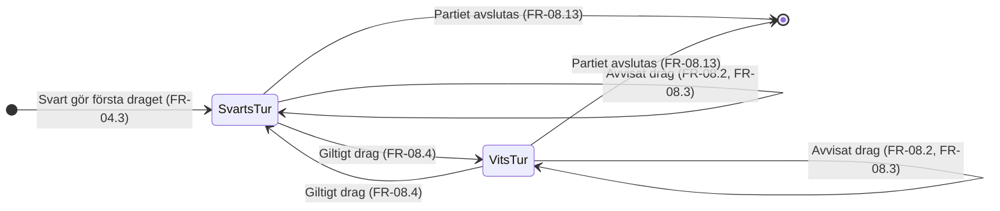

# Tillståndsdiagram – turordning

När partiet väl är i tillståndet `Pågående` växlar brädet mellan två turtillstånd tills partiet
avslutas.

Självövergångarna är inte kosmetik. FR-08.2 och FR-08.3 säger att ett avvisat drag lämnar turen
kvar — det är en händelse som inte byter tillstånd, och det är precis vad AC-02-03 och AC-02-04
verifierar. Utan självövergångarna ser diagrammet ut som att varje drag byter tur.

---

**Relaterade UC:** UC-02, UC-09 · **Krav:** FR-04.3, FR-08.2 – FR-08.4, FR-08.13 · **Testas av:** AC-02-02 – AC-02-04
