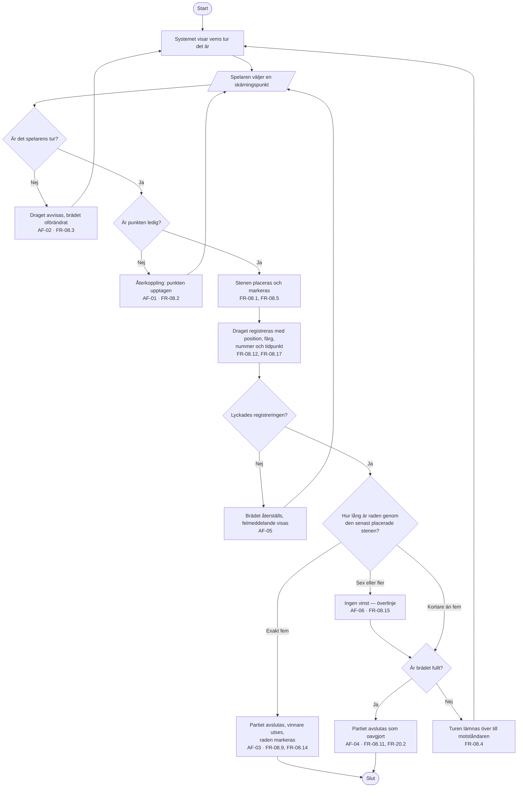

# Aktivitetsdiagram – UC-02 Gör ett drag

Huvudflödet med samtliga sex alternativflöden som grenar. Realiserar FR-08.1 – FR-08.17.

Förgreningen efter en lyckad registrering frågar **hur lång raden är**, inte om det finns fem i
rad. Det är nödvändigt: ett Ja/Nej-beslut har inget svar för en rad på sex stenar, och det är
just den skillnaden FR-08.14 och FR-08.15 gör. Se AC-02-05 och AC-02-06.

---

**Relaterat UC:** UC-02 · **Krav:** FR-08.1 – FR-08.17, NFR-02.2, NFR-02.4 · **Testas av:** AC-02-01 – AC-02-09
