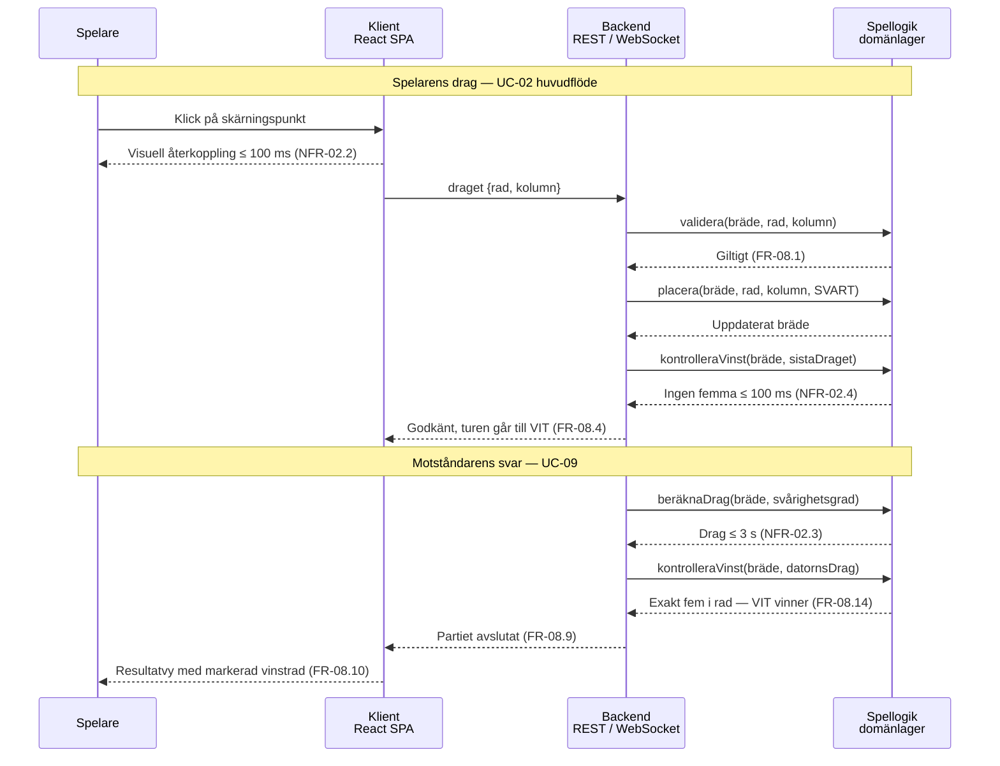

# Sekvensdiagram – UC-02 Gör ett drag, med UC-09

Ett helt varv: spelarens drag, vinstkontroll, datorns svar och partiavslut.

Lagren följer SR-02: klienten är ett React-SPA (SR-02.2), backend exponerar REST och WebSockets
(SR-02.3, SR-02.4) och spellogiken ligger i ett eget domänlager som enligt NFR-09.1 ska gå att
enhetstesta utan webbläsare.

Tidskraven är utsatta på de pilar där de faktiskt mäts. NFR-02.2 mäts i klienten och NFR-02.4 i
domänlagret — de är alltså två olika mätningar trots att båda säger 100 ms.

---

**Relaterade UC:** UC-02, UC-09 · **Krav:** FR-08.1 – FR-08.14, NFR-02.2 – NFR-02.4 · **Testas av:** AC-02-01, AC-02-05, AC-09-02
