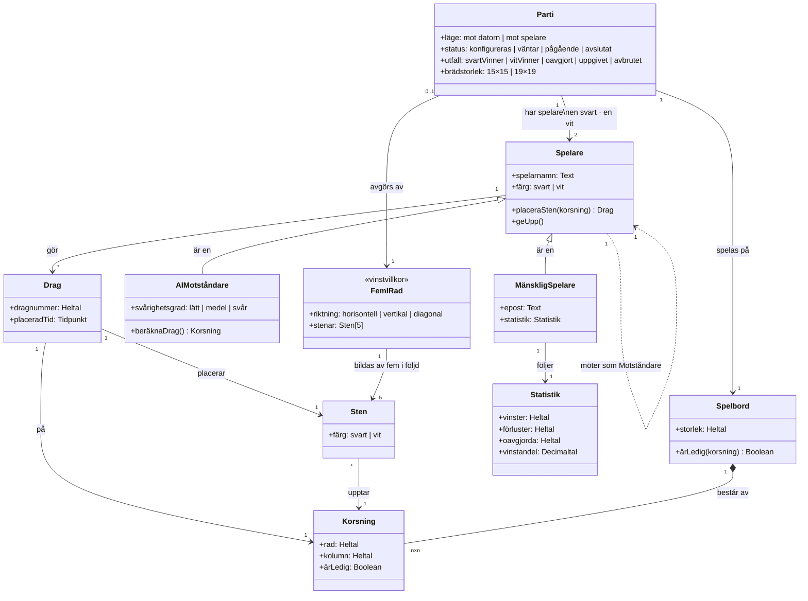

# 5. Begreppsmodell

Begreppsmodellen beskriver verksamhetens centrala begrepp och relationerna mellan dem. Den är
statisk — den säger vad systemet *är*, inte vad det gör. Beteendet ligger i `06-user-journey.md`
och i `../diagrams/uml/`.

Begreppen är namngivna på svenska och följer `00-begreppslista.md`, som är normerande vid konflikt.

## 5.1 Tre regler modellen låser fast

**Exakt fem.** `FemIRad` är ett eget begrepp med `stenar: Sten[5]`. Det är modellens sätt att säga
*exakt fem*, och det motsvarar FR-08.14 och FR-08.15. En modell som i stället sagt `Sten[*]` hade
lämnat frågan öppen.

**Två spelare, en abstraktion.** `Parti` har exakt två `Spelare`. Både `MänskligSpelare` och
`AIMotståndare` ärver från `Spelare`, vilket betyder att spellogiken inte behöver veta vilken sorts
motståndare som sitter på andra sidan. Det är också därför NFR-09.1 — spellogiken separerad från
gränssnittet — går att uppfylla.

**Stenen är permanent.** `Sten` upptar en `Korsning`, och det finns ingen relation som tar bort
den. Att ångra ett drag (UC-19) är därför en operation på `Drag`, inte på `Sten`. Det är en liten
sak i modellen som får stora följder i kraven: FR-12 måste återställa ett *dragregister*, inte
radera en sten.

## 5.2 Modellen mot kraven

| Begrepp | Styrs av |
|---------|----------|
| `Parti.status` | FR-03.3, FR-10.3 — samma fyra tillstånd som `../diagrams/uml/Tillstandsdiagram-partiets-livscykel.md` |
| `Parti.utfall` | FR-08.9 (vinst), FR-20.2 (oavgjort), FR-09.3 (uppgivet), FR-10.5 (avbrutet) |
| `Parti.brädstorlek` | FR-03.2 |
| `Spelare.färg` | FR-04.1 – FR-04.3 |
| `Spelare.placeraSten()` | FR-08.1 |
| `Spelare.geUpp()` | FR-09.1 |
| `AIMotståndare.svårighetsgrad` | FR-05.1 |
| `AIMotståndare.beräknaDrag()` | FR-06.2, NFR-02.3 |
| `Drag.dragnummer` | FR-08.7, FR-08.12 |
| `Drag.placeradTid` | FR-08.17 — finns för att NFR-02.2 och NFR-02.4 ska gå att mäta i efterhand |
| `FemIRad` | FR-08.8, FR-08.14, FR-08.16 |
| `Korsning.ärLedig` | FR-08.2 |

## 5.3 Termöversättning

Modellen var ursprungligen skriven på engelska. Tabellen finns kvar eftersom klassnamnen
sannolikt blir kodens namn, och den som läser en engelsk implementation ska hitta tillbaka hit.

| Svenska | Engelska (tidigare) |
|---------|--------------------|
| Parti | Game |
| Spelare | Player |
| MänskligSpelare | HumanPlayer |
| AIMotståndare | AIOpponent |
| Spelbord | Board |
| Korsning | Intersection |
| Sten | Stone |
| Drag | Move |
| FemIRad | FiveInARow |
| Statistik | Statistics |
| läge · status · utfall · brädstorlek | mode · status · outcome · boardSize |
| spelarnamn · färg | username · colour |
| placeraSten() · geUpp() | placeStone() · forfeit() |
| svårighetsgrad · beräknaDrag() | difficulty · calculateMove() |
| storlek · ärLedig() | size · isEmpty() |
| rad · kolumn | row · col |
| dragnummer · placeradTid | moveNumber · placedAt |
| riktning · stenar | direction · stones |
| vinster · förluster · oavgjorda · vinstandel | wins · losses · draws · winRate |

## 5.4 Öppna frågor

- `Spelare.spelarnamn` är det synliga namnet enligt FR-02.1. `MänskligSpelare.epost` finns bara
  för registrerade spelare. Modellen skiljer i dag inte på gäst och registrerad — bör den?
- `Statistik` är kopplad till `MänskligSpelare`, men `00-begreppslista.md` säger att
  AI-motståndaren inte rankas. Det stämmer, men modellen säger inte *varför* — regeln finns bara i
  SR-01.6.
- `Spelsession` finns i begreppslistan som "en serie av partier" men saknas i modellen.
