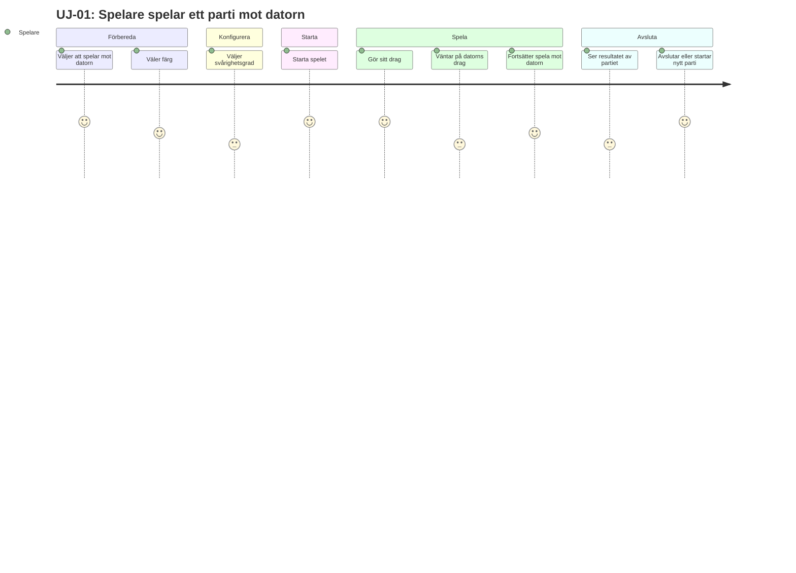
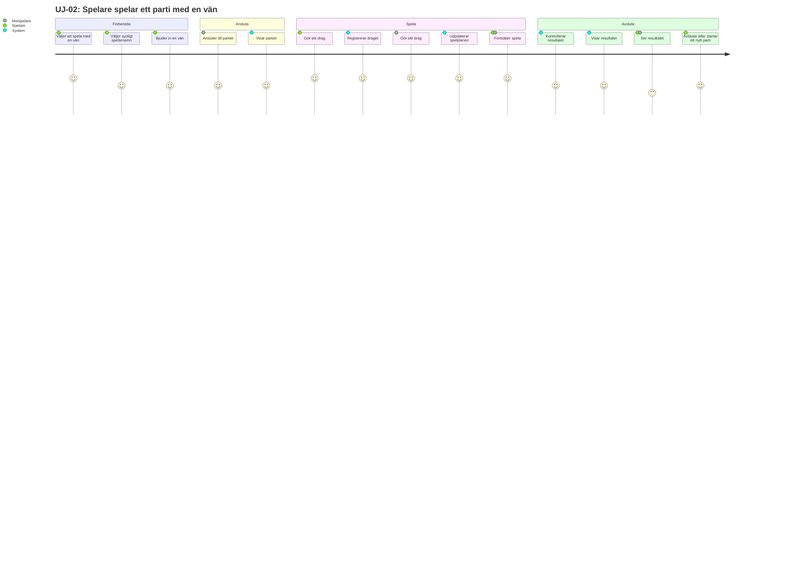

## UJ-01: Spelare spelar ett parti mot datorn

**Aktör:** Spelare

```mermaid
journey
    title UJ-01: Spelare spelar ett parti mot datorn
     section Förbereda
        Väljer att spelar mot datorn: 5: Spelare
        Väler färg: 4: Spelare

    section Konfigurera
      Väljer svårighetsgrad: 3: Spelare

    section Starta
        Starta spelet: 5: Spelare

    section Spela
      Gör sitt drag: 5: Spelare
      Väntar på datorns drag: 3: Spelare
      Fortsätter spela mot datorn: 4: Spelare

    section Avsluta
      Ser resultatet av partiet: 3: Spelare
      Avslutar eller startar nytt parti: 5: Spelare
```

## UJ-03: Spelare spelar ett parti med en vän
**Aktör:** Spelare, Motspelare, System

```mermaid
journey
    title UJ-02: Spelare spelar ett parti med en vän

    section Förbereda
      Väljer att spela med en vän: 5: Spelare
      Väljer synligt spelarnamn: 4: Spelare
      Bjuder in en vän: 4: Spelare

    section Ansluta
      Ansluter till partiet: 4: Motspelare
      Visar partiet: 4: System

    section Spela
      Gör sitt drag: 5: Spelare
      Registrerar draget: 5: System
      Gör sitt drag: 5: Motspelare
      Uppdaterar spelplanen: 5: System
      Fortsätter spela: 5: Spelare, Motspelare

    section Avsluta
      Kontrollerar resultatet: 4: System
      Visar resultatet: 4: System
      Ser resultatet: 3: Spelare, Motspelare
      Avslutar eller startar ett nytt parti: 4: Spelare
```
