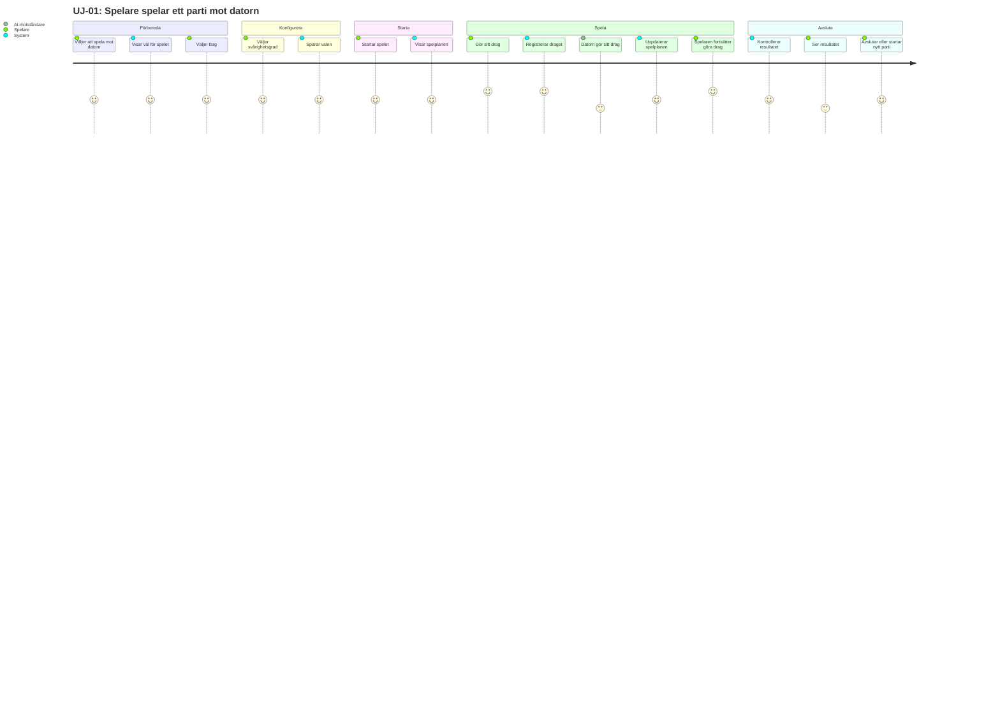
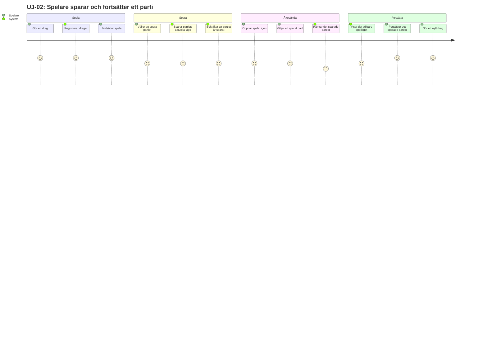

## UJ-01: Spelare spelar ett parti mot datorn

**Aktör:** Spelare

```mermaid
journey
    title UJ-01: Spelare spelar ett parti mot datorn
   section Förbereda
      Väljer att spela mot datorn: 4: Spelare
      Visar val för spelet: 4: System
      Väljer färg: 4: Spelare

    section Konfigurera
      Väljer svårighetsgrad: 4: Spelare
      Sparar valen: 4: System

    section Starta
      Startar spelet: 4: Spelare
      Visar spelplanen: 4: System

    section Spela
      Gör sitt drag: 5: Spelare
      Registrerar draget: 5: System
      Datorn gör sitt drag: 3: AI-motståndare
      Uppdaterar spelplanen: 4: System
      Spelaren fortsätter göra drag: 5: Spelare

    section Avsluta
      Kontrollerar resultatet: 4: System
      Ser resultatet: 3: Spelare
      Avslutar eller startar nytt parti: 4: Spelare
```

## UJ-02: Spelare sparar och fortsätter ett parti
**Aktörer:** Spelare · System

 

```mermaid
journey
    title UJ-02: Spelare sparar och fortsätter ett parti

    section Spela
      Gör ett drag: 5: Spelare
      Registrerar draget: 5: System
      Fortsätter spela: 5: Spelare

    section Spara
      Väljer att spara partiet: 4: Spelare
      Sparar partiets aktuella läge: 4: System
      Bekräftar att partiet är sparat: 4: System

    section Återvända
      Öppnar spelet igen: 4: Spelare
      Väljer ett sparat parti: 4: Spelare
      Hämtar det sparade partiet: 3: System

    section Fortsätta
      Visar det tidigare spelläget: 4: System
      Fortsätter det sparade partiet: 5: Spelare
      Gör ett nytt drag: 5: Spelare
```
