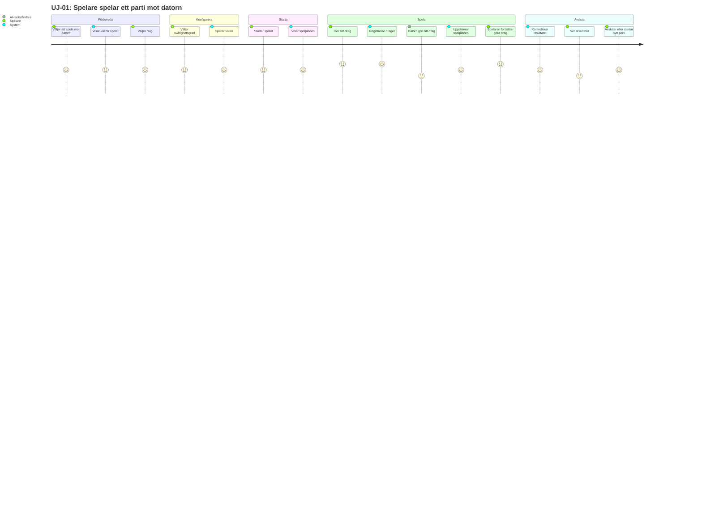
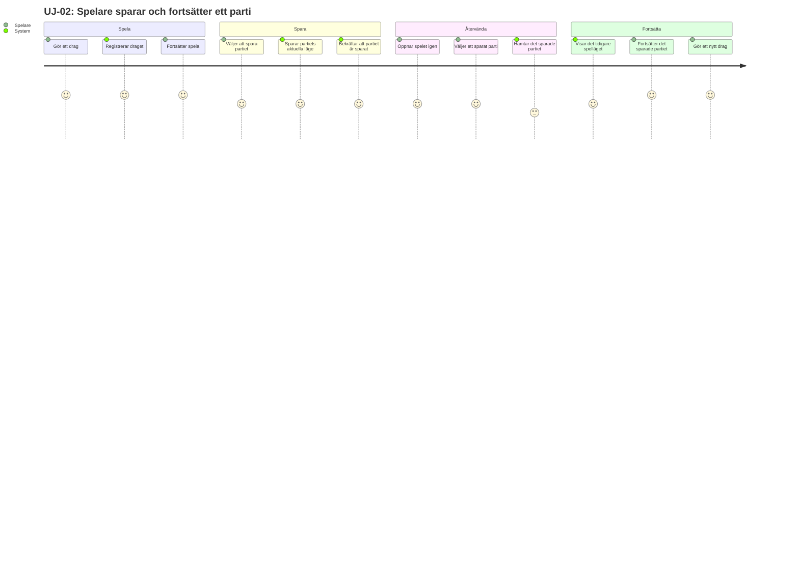
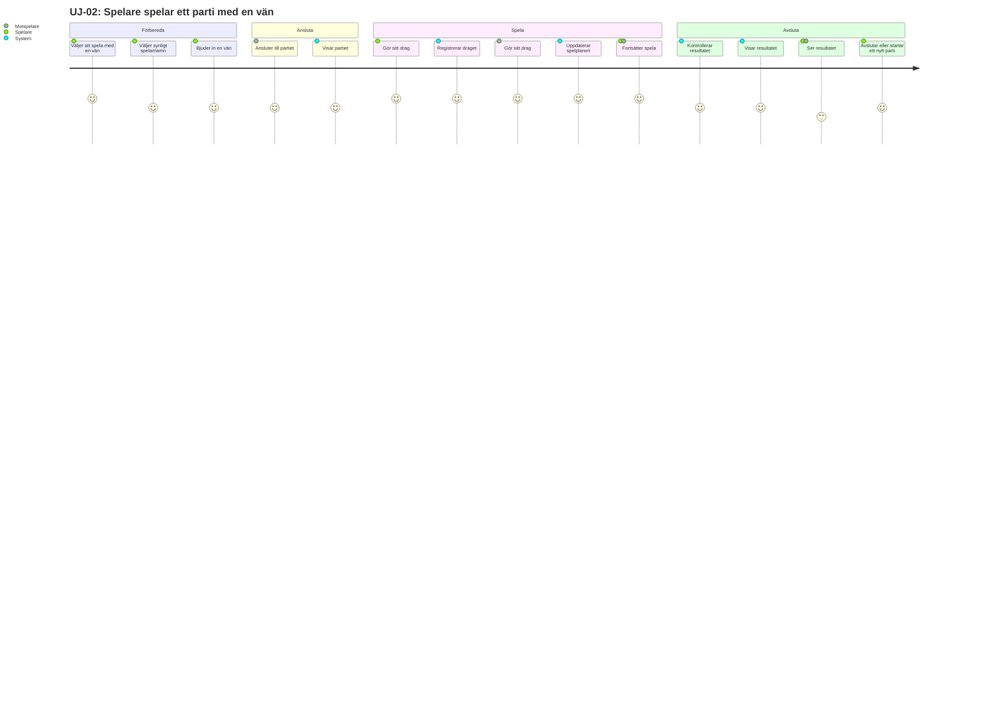
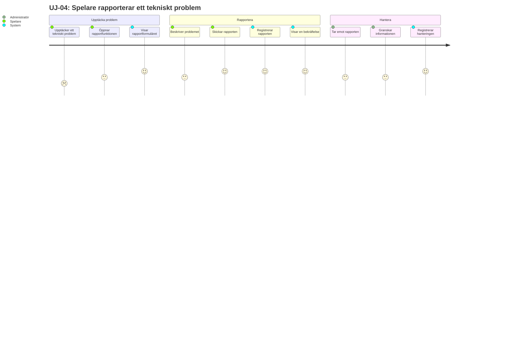

## UJ-01: Spelare spelar ett parti mot datorn

**Aktör:** Spelare

## UJ-02: Spelare sparar och fortsätter ett parti
**Aktörer:** Spelare · System

 

## UJ-03: Spelare spelar ett parti med en vän
**Aktör:** Spelare, Motspelare, System

## UJ-04: Spelare rapporterar ett tekniskt problem
**Deltagare:** Spelare, System, Administratör

