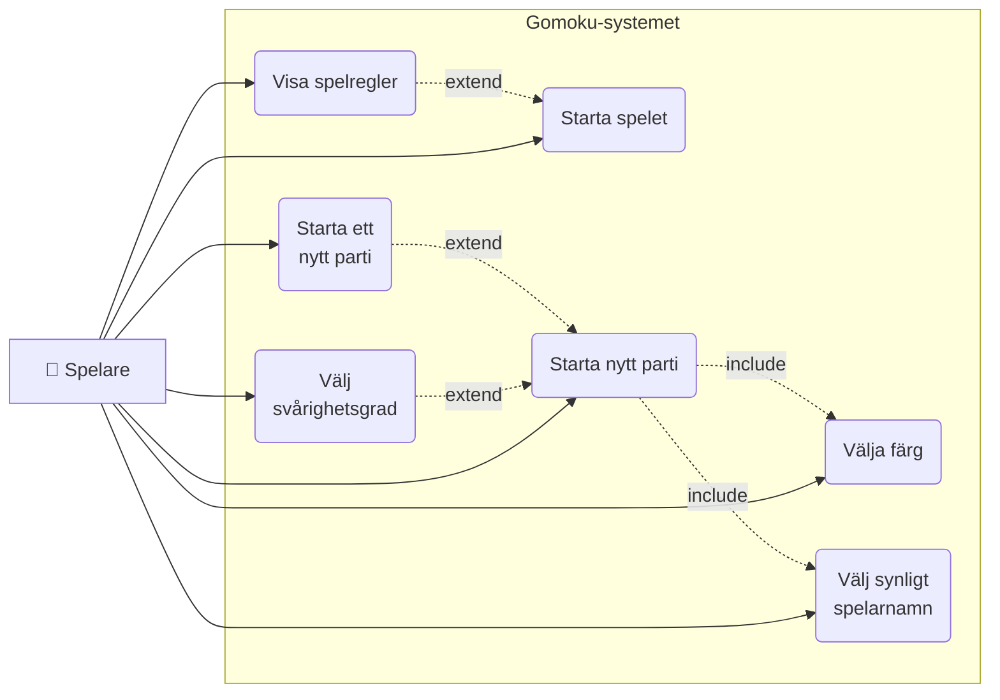
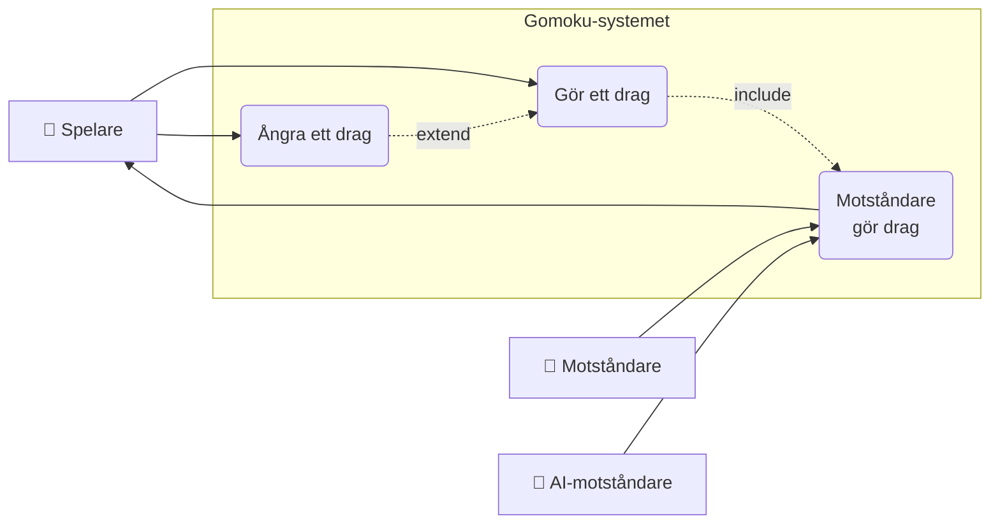
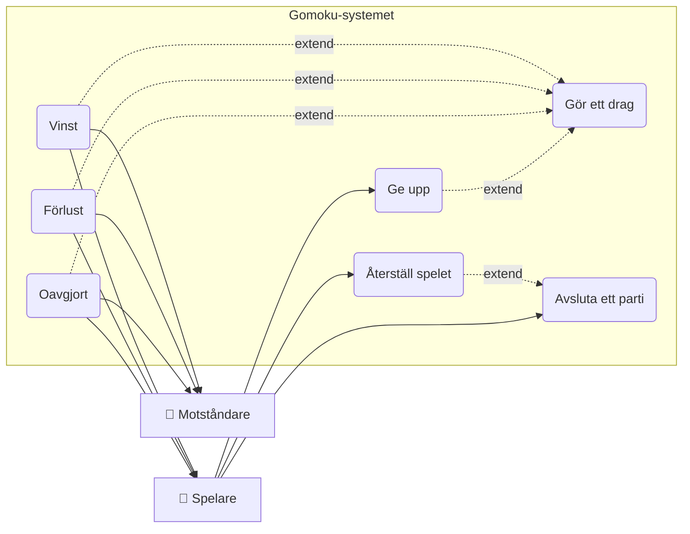
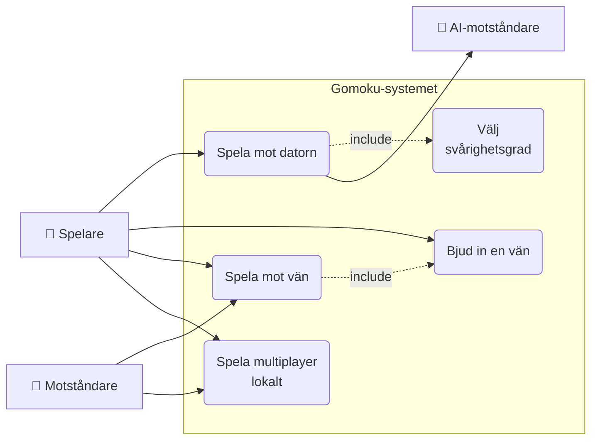
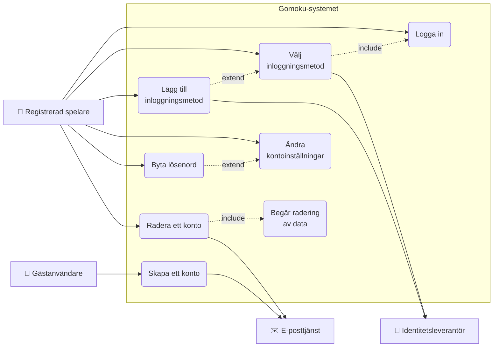
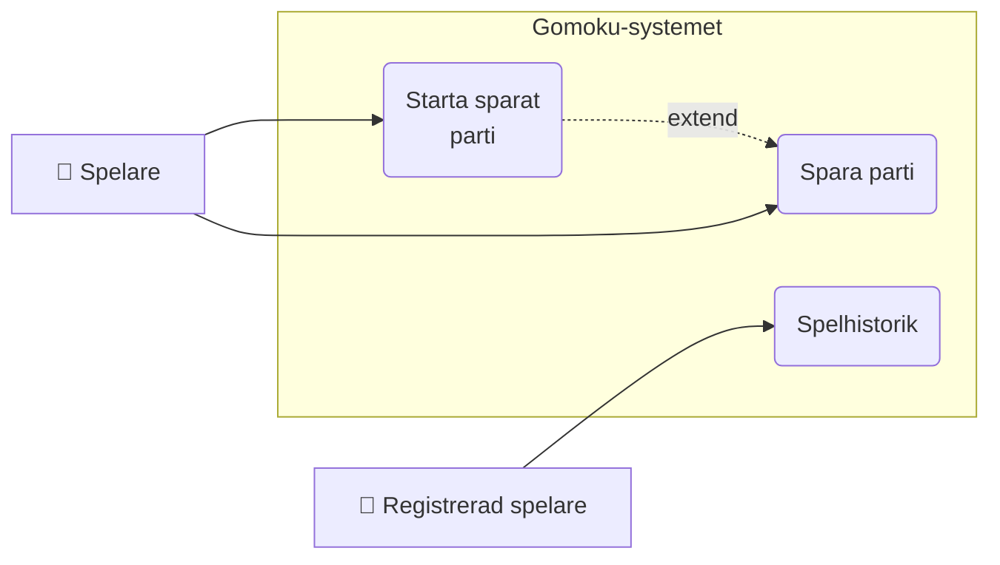
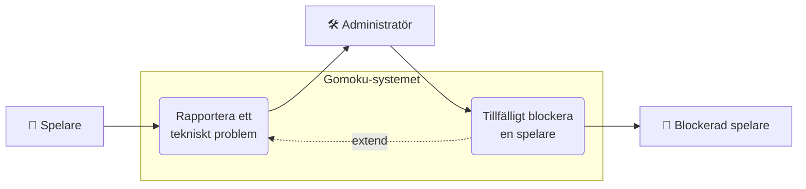
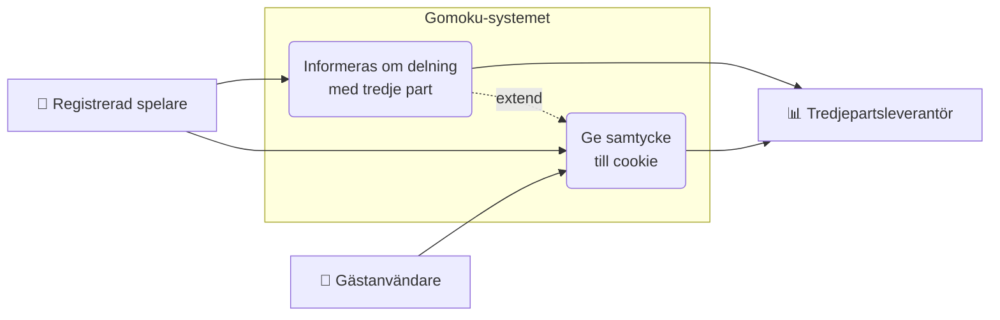
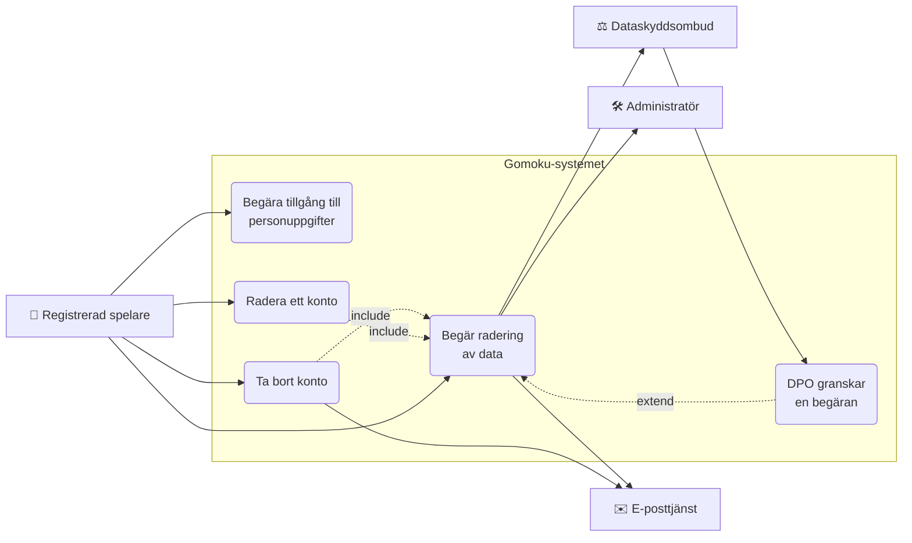
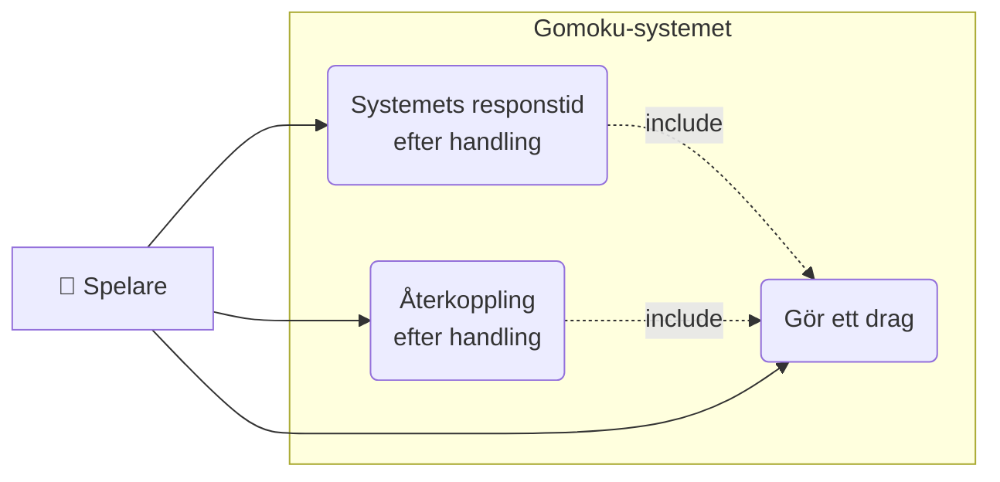

[← Tillbaka till README](../../README.md)

# 7. Use Cases – översikt

Denna fil är ingången till `use-cases/`. Den listar samtliga användningsfall, vilken aktör som
äger dem, vilka krav de realiserar och hur de hänger ihop. Detaljerna står i respektive UC-fil —
här visas bara strukturen.

Strukturen följer avsnittsindelningen i `01-inledning.md` 1.5.

---

## 7.1 Aktörer

| Aktör | Förkortning | Typ | Beskrivning |
|-------|-------------|-----|-------------|
| Spelare | SP | Primär, människa | Den som spelar ett parti. Samlingsroll för GÄ och RS — de flesta use case skiljer inte på dem. |
| Gästanvändare | GÄ | Primär, människa | Oautentiserad besökare. Kan spela mot datorn men saknar historik, topplista och sociala funktioner. |
| Registrerad spelare | RS | Primär, människa | Autentiserad användare med profil. Har tillgång till alla spellägen, historik och GDPR-självbetjäning. |
| Motståndare | MO | Primär, människa | Den andra mänskliga spelaren i ett parti, lokalt eller online. |
| Administratör | AD | Primär, människa | Plattformsoperatör som hanterar rapporter och modereringsärenden. |
| Dataskyddsombud | DPO | Primär, människa | Övervakar GDPR-efterlevnad och hanterar eskalerade förfrågningar från registrerade. |
| AI-motståndare | AI | Sekundär, system | Datorstyrd spelare. Behandlas som spelare enligt reglerna men rankas inte. |
| E-posttjänst | EP | Sekundär, extern | Skickar verifieringar och bekräftelser. |
| Identitetsleverantör | IDP | Sekundär, extern | Extern inloggningstjänst (t.ex. Google). |
| Tredjepartsleverantör | TP | Sekundär, extern | Databehandlare som behandlar personuppgifter för vår räkning. |

> **Samordnad med `01-inledning.md` 1.4.** Aktörsnamnen var tidigare olika i de två filerna —
> *Besökare* mot *Gästanvändare*, *Administratör* mot *Systemadministratör*. Listan i 1.4 är
> omskriven och använder nu samma namn och förkortningar som tabellen ovan.

---

## 7.2 Funktionella användningsfall

| UC-ID | Namn | Primär aktör | Sekundär aktör | Relaterade FR |
|-------|------|--------------|----------------|---------------|
| UC-01 | Starta nytt parti | SP | AI | FR-03.1 – FR-03.9 |
| UC-02 | Gör ett drag | SP | MO, AI | FR-08.1 – FR-08.17 |
| UC-03 | Bjud in en vän | SP | MO | FR-07.1 – FR-07.10 |
| UC-04 | Välja färg | SP | MO, AI | FR-04.1 – FR-04.7 |
| UC-05 | Spela mot datorn | SP | AI | FR-06.1 – FR-06.9, FR-08.8 |
| UC-06 | Starta spelet | SP | — | FR-01.1 – FR-01.5 |
| UC-07 | Välj ditt synliga spelarnamn | SP | — | FR-02.1 – FR-02.7 |
| UC-08 | Välj svårighetsgrad | SP | AI | FR-05.1 – FR-05.7 |
| UC-09 | Motståndare gör drag | AI, MO | SP | FR-06.2 – FR-06.5, FR-08.4, FR-08.8 |
| UC-10 | Spela mot vän | SP | MO | FR-07.5, FR-07.8, FR-07.9, FR-08.1, FR-08.4 |
| UC-11 | Ge upp | SP | MO | FR-09.1 – FR-09.6 |
| UC-12 | Avsluta ett parti | SP | MO | FR-10.1 – FR-10.5 |
| UC-13 | Starta ett nytt parti | SP | MO | FR-03.1, FR-03.7 |
| UC-14 | Oavgjort | SP, MO | AI | FR-08.11, FR-20.1 – FR-20.5 |
| UC-15 | Förlust | SP, MO | AI | FR-08.9, FR-08.10, FR-08.13 |
| UC-16 | Vinst | SP | MO, AI | FR-06.5, FR-08.8 – FR-08.10, FR-08.13 |
| UC-17 | Spelhistorik | RS | — | FR-11.1 – FR-11.5 |
| UC-18 | Spela multiplayer lokalt | SP | MO | FR-21.1 – FR-21.7, FR-04.5, FR-08.1, FR-08.3, FR-08.4 |
| UC-19 | Ångra ett drag | SP | AI | FR-12.1 – FR-12.10 |
| UC-20 | Visa spelregler | SP | — | FR-22.1 – FR-22.7, FR-01.2 |
| UC-21 | Skapa ett konto | GÄ | EP | FR-13.1 – FR-13.5 |
| UC-22 | Logga in | RS | — | FR-14.1 – FR-14.8 |
| UC-23 | Radera ett konto | RS | EP | FR-15.1 – FR-15.8, FR-30.5 – FR-30.7 |
| UC-24 | Lägg till inloggningsmetod | RS | IDP | FR-16.1 – FR-16.7 |
| UC-25 | Välj inloggningsmetod | RS | IDP | FR-25.1 – FR-25.5 |
| UC-26 | Spara parti | SP | — | FR-26.1 – FR-26.9 |
| UC-27 | Starta sparat parti | SP | — | FR-17.1 – FR-17.5 |
| UC-28 | Rapportera ett tekniskt problem | SP | AD | FR-28.1 – FR-28.10 |
| UC-29 | Tillfälligt blockera en spelare | AD | RS (blockerad) | FR-29.1 – FR-29.15 |
| UC-30 | Ändra kontoinställningar | RS | — | FR-18.1 – FR-18.4 |
| UC-31 | Byta lösenord | RS | — | FR-19.1 – FR-19.5 |
| UC-32 | Återställ spelet | SP | MO | FR-23.1 – FR-23.8, FR-03.7, FR-08.13 |

### 7.2.1 Spelstart och konfiguration

### 7.2.2 Spelets gång

### 7.2.3 Partiavslut och resultat

### 7.2.4 Motståndare och spellägen

### 7.2.5 Konto och inloggning

### 7.2.6 Historik och sparade partier

### 7.2.7 Problemrapportering och moderering

> **Om kopplingen UC-29 → UC-28.** Den streckade linjen finns inte i någon av de två filerna.
> UC-28 beskriver en rapport som "registreras för vidare hantering" och UC-29 förutsätter att
> "det finns ett modereringsärende kopplat till spelaren", men ingen av dem säger att det är
> samma ärende. De möts i praktiken men inte i dokumentationen. Linjen är ritad här som förslag
> — antingen bekräftas den och skrivs in i båda filerna, eller så måste det stå var
> modereringsärendet annars kommer ifrån.

---

## 7.3 Icke-funktionella användningsfall och GDPR

| UC-ID | Namn | Primär aktör | Sekundär aktör | Relaterade NFR |
|-------|------|--------------|----------------|----------------|
| UC-NFR-01 | Ge samtycke till cookie | GÄ | TP | NFR-07.4, SR-02.7, FR-24 |
| UC-NFR-02 | Begära tillgång till personuppgifter | RS | — | NFR-10.1, NFR-10.2, FR-27 |
| UC-NFR-03 | Informeras om delning med tredje part | RS | TP | NFR-11.1, NFR-11.2, FR-31 |
| UC-NFR-04 | Begär radering av data | RS | AD, DPO, EP | NFR-12.1 – NFR-12.7, NFR-07.1, NFR-07.5 |
| UC-NFR-05 | Ta bort konto | RS | EP | NFR-12.1 – NFR-12.7, NFR-07.1 |
| UC-NFR-06 | Systemets responstid efter handling | SP | — | NFR-02.1 – NFR-02.7 |
| UC-NFR-07 | Spelaren får återkoppling efter handling | SP | — | NFR-02.2, NFR-02.5, NFR-02.7, NFR-06.1 – NFR-06.3, NFR-04.1 |
| UC-NFR-08 | DPO granskar en raderingsbegäran | DPO | AD, EP | NFR-12.2, NFR-12.6, NFR-07.1, FR-32 |

### 7.3.1 Samtycke och information

### 7.3.2 Datarättigheter

### 7.3.3 Prestanda och återkoppling

---

## 7.4 Prioriteringsmatris

MoSCoW-indelning. **Förslag — gruppen har inte beslutat detta ännu.** Principen bakom förslaget
är att MVP är ett spelbart parti mot datorn utan inloggning, plus det som krävs rättsligt för att
få publicera det alls.

| Prioritet | Användningsfall |
|-----------|-----------------|
| Must have (MVP) | UC-01, UC-02, UC-04, UC-05, UC-06, UC-07, UC-08, UC-09, UC-11, UC-14, UC-15, UC-16, UC-20, UC-NFR-01, UC-NFR-06, UC-NFR-07 |
| Should have | UC-03, UC-10, UC-12, UC-13, UC-18, UC-21, UC-22, UC-23, UC-32, UC-NFR-02, UC-NFR-04, UC-NFR-05 |
| Could have | UC-17, UC-19, UC-24, UC-25, UC-26, UC-27, UC-28, UC-29, UC-30, UC-31, UC-NFR-03 |

UC-NFR-01 ligger i MVP eftersom SR-02.7 förbjuder tredjepartsskript före samtycke — utan det får
systemet inte publiceras med analysverktyg. UC-23 ligger under Should tillsammans med UC-21 och
UC-22: så snart det finns konton krävs radering enligt GDPR artikel 17, men finns inga konton
behövs inget av dem.

---

## 7.5 Användningsfall sorterade på aktör

| Aktör | Äger som primär aktör | Antal |
|-------|----------------------|-------|
| Spelare (SP) | UC-01 – UC-08, UC-10 – UC-16, UC-18, UC-19, UC-20, UC-26, UC-27, UC-28, UC-32, UC-NFR-06, UC-NFR-07 | 24 |
| Registrerad spelare (RS) | UC-17, UC-22, UC-23, UC-24, UC-25, UC-30, UC-31, UC-NFR-02, UC-NFR-03, UC-NFR-04, UC-NFR-05 | 11 |
| Gästanvändare (GÄ) | UC-21, UC-NFR-01 | 2 |
| Motståndare (MO) | UC-09, UC-14 | 2 |
| Administratör (AD) | UC-29 | 1 |
| Dataskyddsombud (DPO) | UC-NFR-08 | 1 |
| AI-motståndare (AI) | UC-09 | 1 |

**Två observationer.**

Dataskyddsombudet stod tidigare som primär aktör i `01-inledning.md` utan att äga ett enda
användningsfall, trots att UC-NFR-04 skickar två eskaleringar dit. UC-NFR-08 är tillagt och
beskriver vad som händer på andra sidan av den eskaleringen. Administratören äger fortfarande bara
UC-29 — lärarens referensrepo har till exempel *Admin Reviews Consent Audit Log*, som saknar
motsvarighet här.

Tyngdpunkten ligger på Spelare med 24 av 40 användningsfall. Det stämmer med systemets syfte,
men det betyder också att de flesta kraven är skrivna ur ett enda perspektiv.

---

## 7.6 Kända problem i användningsfallen

Punkter som den här översikten gjorde synliga. Fem av sex är åtgärdade.

| # | Problem | Status |
|---|---------|--------|
| 1 | **Tre överlappande use case för att starta ett parti.** UC-06 *Starta spelet*, UC-01 *Starta nytt parti* och UC-13 *Starta ett nytt parti* beskriver delvis samma sak. UC-13 har bara två egna FR och skulle kunna vara ett alternativflöde i UC-01. | **Öppet** — en sammanslagning är ett designbeslut som gruppen måste ta, inte ett skrivfel. |
| 2 | **Systemet stod som primär aktör i UC-14 och UC-15.** Kursens definition är att en aktör *konsumerar* förväntade resultat; systemet konsumerar ingenting. | Rättat — UC-14 har nu Spelare och Motståndare, UC-15 har Spelare. Se ändringsloggen i respektive fil. |
| 3 | **"Systemet" och "Databasen" stod som sekundära aktörer** i 23 av 39 filer. Interna komponenter, inte aktörer. | Rättat i samtliga 23 filer. |
| 4 | **Aktörsnamnen skilde sig** mellan `01-inledning.md` och UC-filerna: Besökare/Gästanvändare, Administratör/Systemadministratör. Inledningen motsade dessutom sig själv mellan 1.3 och 1.4. | Rättat — 1.4 är omskriven och UC-NFR-01 använder Gästanvändare. |
| 5 | **Fyra use case saknade egna FR:** UC-32, UC-NFR-01, UC-NFR-02, UC-NFR-03. | Rättat — FR-23, FR-24, FR-27 och FR-31 tillagda. Det fyllde samtidigt de sista hålen i FR-numreringen, som nu är obruten 1–32. |
| 6 | **Inget use case för dataskyddsombudet**, trots att det stod som primär aktör och tar emot två eskaleringar från UC-NFR-04. | Rättat — UC-NFR-08 tillagt, med FR-32 och AC-NFR-08. |

## 7.7 Var kraven och testfallen finns

| Vad | Var |
|-----|-----|
| Användningsfallen i sin helhet | `use-cases/` |
| Funktionella krav (FR) | `02-funktionella-krav.md` |
| Kompletterande krav och affärsregler (SR) | `03-kompletterande-krav.md` |
| Icke-funktionella krav (NFR) | `04-icke-funktionella-krav.md` |
| Acceptanskriterier (AC) | `Acceptance-Criterias/` |
| Use case kopplade till testfall | `08-use-cases-och-test-cases.md` |
